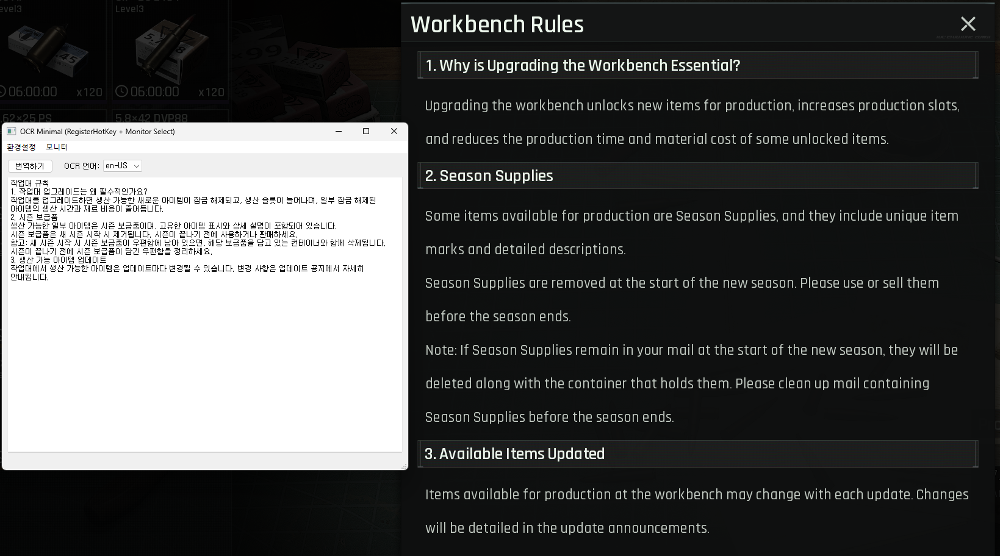

# OCR-translator

OCR-translator는 OCR을 이용해 화면의 텍스트를 추출 후 번역하는 간단한 프로그램입니다.

이 프로젝트는 [MORT](https://github.com/killkimno/MORT) 프로젝트로부터 영감을 받아 만들어졌으며, 해당 프로그램의 일부 기능을 수행합니다. 해당 프로젝트를 진행하고 유지해 주신 [monkeyhead](https://github.com/killkimno) 님께 감사드립니다.

# MORT

MORT는 다양한 번역 api와 연동하여 화면상의 글자를 추출해 번역하는 프로그램입니다.

번역 기능으로는 실시간/화면캡처 모드가 있어 주기적으로 번역할지, 사용자가 수동으로 번역할 지 선택할 수 있습니다.

디스플레이 기능으로는 일반 모드/오버레이 모드가 있으며, 오버레이 모드는 기존의 문장 위에 번역본을 오버레이로 띄울 수 있습니다.

# Why not MORT?
MORT 프로그램은 많은 기능을 갖췄으며, 복잡하고 정밀한 기능을 제공하지만 몇 가지 문제점이 존재합니다.
* 핫키 등록 실패: 몇몇 게임에서는 키보드 입력을 MORT가 인식하지 못해 핫키 동작이 불가능합니다.
* 캐싱: LLM 토큰을 절약하기 위해 MORT는 응답을 캐싱하는데, 잘못된 응답 또한 검사 없이 캐싱하여 번역의 질이 떨어집니다.

# Difference between MORT and this project
MORT는 기본적으로 텍스트 기반의 게임을 번역하기 위해 개발되었으며, 번역하는 문장의 대부분이 중복된 문장이므로 캐싱이 필수적입니다.

또한 텍스트 기반 게임 특징 상 텍스트 창이 고정되어 있으며, OCR의 텍스트 탐지 정확도 또한 매우 높은 환경입니다.

하지만 이러한 MORT의 특징은 경쟁 기반 게임의 중복이 적은 텍스트(툴팁, 시스템 설명 등)을 번역할 때 필요하지 않은 기능이며, 오히려 잘못된 응답을 캐싱하여 번역의 질을 저하시키는 문제가 발생할 수 있습니다.

또한 텍스트 창의 위치와 형식이 고정되어 있지 않아 MORT는 텍스트 영역을 추출하는 데 있어 성능 저하를 겪으며, 오버레이 모드에서 기대 이하의 정확도를 보입니다.

OCR-translator 프로젝트는 이러한 MORT의 문제점을 해결하기 위해 개발되었으며, MORT를 개선한 대체제가 아닌 MORT가 기대하는 게임과 다른 종류의 게임에 최적화하기 위한 프로젝트입니다.
 
# Long-term, private project
이 프로젝트는 개인이 사용하기 위한 목적으로 개발되었습니다. 일부 기능은 미구현으로 남을 수 있으며, 이 프로젝트를 참조하여 개인 프로젝트에 활용할 수 있습니다.

# Demonstration

